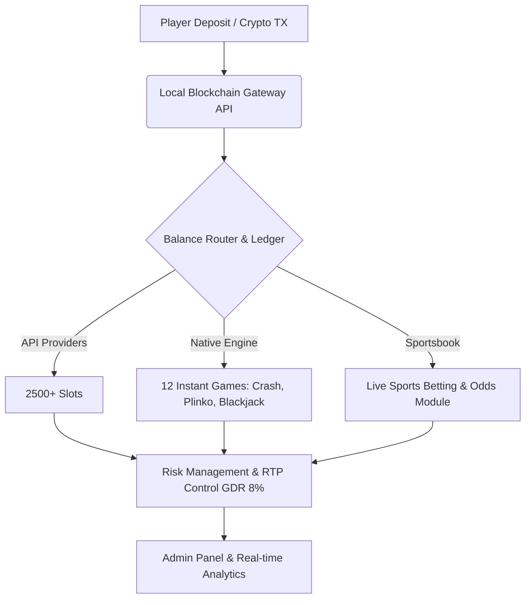

<h1> # 🎰 Goldsvet Casino Open Source Engine </h1>    

**Next-generation enterprise iGaming software:** complete decentralization, maximum uptime, clean open-source code without encryption or backdoors.

[🌐 Official Website & Detailed Product Overview](https://mintscripts.net/market/61-kupit-skript-kazino-pod-kljuch-goldsvet-crypto-casino-s-api-pragmatic-play-i-hacksaw.html)

      
   
   

## ⚡ Next-Gen Engine Overview

Introducing a flagship solution for the international gambling market — a fully modified, lightweight, and ultra-fast engine based on modernized Goldsvet architecture. Unlike raw public builds, our script is optimized for extreme high loads, completely free of vulnerabilities, IonCube encodings, and hidden backdoors.

The platform architecture ensures seamless deployment on both dedicated VPS/VDS servers (Hetzner, Contabo) and fault-tolerant clusters. The primary focus is set on the **Crypto Casino** concept and complete financial autonomy for the operator.

## 🏗 Architecture & Data Flow

Below is the diagram illustrating real-time gateway operations and game session processing:

### 💎 Key Features & Capabilities

* **🎰 2500+ Auto-Updating Slots:** Direct API integration with top global providers  with the ability to integrate alternative studios on demand.
* **⚽ Built-in Sportsbook Module:** Full-scale sports betting line (football, basketball, tennis, esports) with customizable odds and an intuitive admin panel.
* **🚀 12 Instant Games (No API Required):** Autonomous internal games (Crash, Plinko, Mines, Blackjack) running directly on your server with zero monthly third-party traffic fees.
* **🔗 Direct Crypto Payments (0% Fees):** Local blockchain gateways for USDT, TON, TRON, and other networks. Deposits and withdrawals are credited directly to your wallets without intermediaries or aggregators.
* **🎯 Advanced Retention System:** Multi-tier loyalty program, player ranks, weekly cashback up to 15%, dynamic tournaments, free spins shop, and customizable promotional banners.
* **⚙️ RTP Control:** Fine-tuning of the return-to-player percentage (GDR adjustment at 8%+ level for stable business profitability).

### 📊 Competitive Matrix

| Comparison Criteria | 🚀 Code Core (Mint Scripts)  | ❌ Standard Public Builds |
| :--- | :--- | :--- |
| **Source Code** | **100% Open Source**, unencrypted | Encoded via IonCube, hidden security risks |
| **Crypto Payments** | **Custom Local Gateways (0% fees)** | Paid aggregators (5% to 12% turnover cut) |
| **Games Without API** | **12 Built-in Instant Games** (full autonomy) | None (every game requires paid API feeds) |
| **Security** | Complete code audit, zero backdoors | High risk of hacks and database leaks |
| **Marketing Tools** | Free spins shop, wheel of fortune, ranks, tournaments | Basic profile and standard slot catalog only |

### ❓ Frequently Asked Questions (FAQ)

**1. How to purchase a turnkey crypto casino with open-source code?**  
You can acquire a fully production-ready software product, review delivery packages, and order professional installation on the official developer page: [Buy Turnkey Casino Script Goldsvet Crypto Casino](https://mintscripts.net/market/61-kupit-skript-kazino-pod-kljuch-goldsvet-crypto-casino-s-api-pragmatic-play-i-hacksaw.html).

**2. What are the benefits of an open-source architecture?**  
Open source guarantees absolute security, independence from third-party developers, and the ability to perform a full audit of every line of script. You retain total control over your server infrastructure and financial cash flows.

**3. Can I integrate other providers or remove third-party APIs?**  
Yes, the engine architecture is fully modular. You can easily plug in alternative game aggregators, disconnect external slots, and rely exclusively on native instant games or custom developments.

**4. How are financial security and settlements handled?**  
All settlements occur directly through the blockchain without intermediary payment gateways. Customer funds are credited instantly to your wallets, and the system supports both manual payout audits and fully automated modes.

*This material is the intellectual property of Code Core & Mint Scripts Technology Lab.*  
*© 2026 Code Core — Web3 & iGaming Architectural Engineering.*
